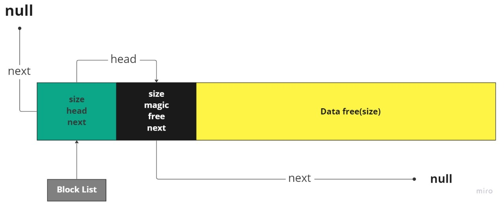
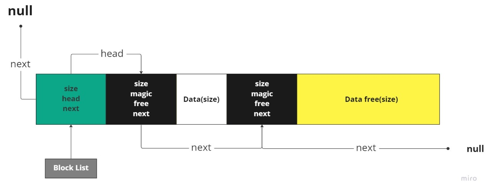
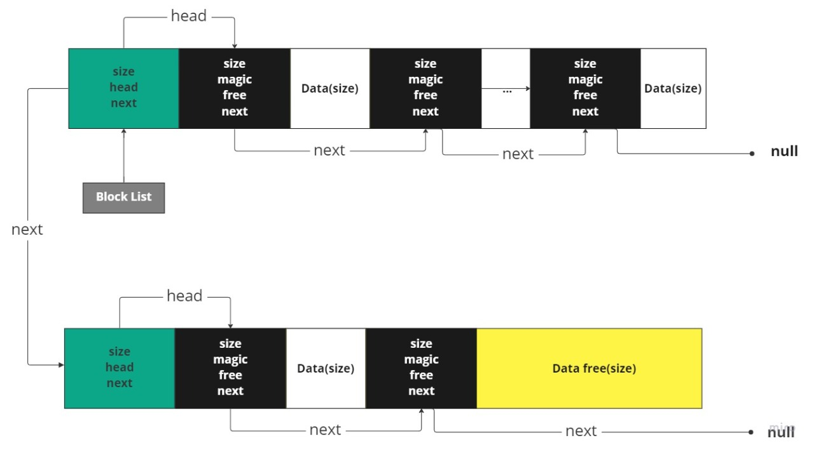

# **TP: malloc**

En el siguiente informe se explica como fue la implentacíon, para la librería, de la funciones **malloc(3)**, **calloc(3)**, **realloc(3)** y **free(3)**.

### **Parte 1: Administración de bloques**
***

Para esta parte inicial, se penso en una estructura de bloque compuesta por un header que nos indicara la cantidad de regiones(n_chunks) que esta tendra cuando se hagan los llamados a malloc, un head que es un puntero a la lista de regiones que tenga el bloque, un size que nos indica el tamaño del bloque y un puntero next que nos lleva al siguiente bloque.

&nbsp;

&nbsp;

Por cada pedido de memoria que se haga se estara particionando en diferentes regiones, las cuales estan compuestos por un header que posee un size que nos indicará el tamaño de la región, un flag free que nos idicará la disponibilidad de la region, un número mágico que nos identifica el tipo de la región y un puntero next que nos lleva a la siguiente región que contenga el bloque.

&nbsp;

&nbsp;

Con el primer llamado a malloc se hace la reserva de memoria de tamaño fijo con mmap, si es que la cantidad de memoria pedida no exceda el tamaño fijo que esta pueda pedir, devolviendo un puntero a la region memoria cuyo tamaño minimo sera ALIGN4 y un NULL si es que existiera algun error. Para los siguientes llamados a malloc se irá dividiendo sucesivamente el bloque en regiones con el flag free en 0 para indicar que esta ocupado y el size con el tamaño de memoria solicitada, si es que no hubiera ya la posibilidad de seguir diviendo el bloque se retornara NULL.

Cuando se haga la liberación de la región, **habiendo hecho un previo llamado a malloc**, se libera el flag free poniendose en 1 y revisando si es que hubiera otra region libre para hacer coalising e unir las regiones en una sola, posteriormente se hace una revision para liberar el bloque si es que este no posee ninguna region ocupada. Si es que se quisiera hacer free de una region ya liberada, qoptamos por elegir, al ser un comportamiento insperado, terminar abrutamente la ejecución de programa y si es un puntero null no se realiza ninguna acción.

### **Parte 2: Agregando mas bloques**
***
Para esta parte, se decidio manejar los bloques a traves de un puntero(block_list), la forma en como se manejan las regiones de los bloques sera la misma como en la primer parte. Ahora el tamaño de los bloques va estar manejado por 3 diferentes size: ***BIG_BLOCK***, ***MEDIUM_BLOCK*** y ***SMALL_BLOCK***.

El primer malloc ahora tendra la posibilidad de elegir entre 3 diferentes tamaños para darle al bloque, dependiendo de la memoria pedida, si es que ya existiese un bloque el cual la cantidad de memoria disponible fuese inferior a la solicitada entonces se hará la creación de un bloque nuevo, modificando del puntero next del bloque actual al nuevo bloque.

Cuando una liberación de alguna region es realizada, se hara el chequeo del bloque para determinar si es que en su puntero head el puntero siguiente es nulo y su estado es free y es en ese caso, se hará la liberación del bloque con ***munmap()***.

&nbsp;

&nbsp;

### **Parte 3: Mejorando la búsqueda de regiones libres**
***
En esta parte del trabajo, se almplio la función de busqueda, agregando ***best_fit***, ahora se recorrera la lista de bloques que se tenga disponible, y en cada bloque se recorrerá la lista de regiones que tienen, encontrando la region mas optima posible para el tamaño de bloque pedido con ***malloc()***.

Tambien se agregó a la libreria la función **calloc()**, realmente no tuvimos mucho inconveniente con esta función, el único inconveniente encontrado fue quizas darnos cuenta de la alineación que se te tenia que realizar ***ALIGN4(size * nmemb)*** para poder setear los bits a 0 de la memoria solicitada, pero fuera de esa pequeña dificultada, esta función trabaja de la misma manera que la funcion ***calloc()*** ofrecida por c, validando si alguno de los tamaños es igual 0 o si la multiplicación de los tamaños produce un desbordamiendo de enteros, devolviendo para esos casos null y seteando errno = 0, y si pasamos esos filtro hacemos el llamado a malloc dentro de calloc con el tamaño size * nmemb.
&nbsp;
### **Parte 4: Agrandar/Achicar Regiones**
***
En esta parte se implemento **realloc()**, fue una de las partes del desarrollo donde se presento mayor inconveniente, sobre todo con la verificación de los test.

Cuando se usa esta función lo q primero que hacer es verificar si es un puntero valido, si no es retornamos NULL, si el puntero ingresado es NULL, realloc se comporta como malloc, derivando la responsabilidad a ***malloc()*** retornando su resultado, si por el contrario el tamaño ingresado es 0, la responsabilidad se asigna a ***free()*** y retornamos NULL, si ninguno de los escenarios anteriores ocurrieron nos fijamos si la region es compatible con el identificador de la estructura que es ***MAGIC*** o si este esta libre, y si esta libre **o** no es compatible retornamos NULL, Si el tamaño de la region nueva es menor a la de la region actual, se devolvera el mismo puntero, si este es mayor se hara se pasa a malloc con el tamaño solicitado, este buscar en la lista si existe una region disponible, si no encontrase lo crea, posteriormente copiamos el contenido que ya se tenia en el la region anterior, liberamos el puntero y devolvemos el puntero a la nueva región .
&nbsp;
### **Ejecución para los test**
Para realizar la ejecución de los test se debera emplementar los siguientes comandos:

Con Best Fit:   make run-s -B -e USE_BF=true
Con First Fit:  make run-s -B -e USE_FF=true

